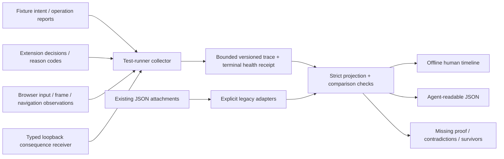

# Evidence Observatory architecture

Status: initial read-only implementation and staged design, 2026-09-13.
Source grounding: main `476301ad1c4b56fc83ed335ac83e343dc93d675e`.

## The question the system must answer

A green test or a toast saying “blocked” is not enough. The owner needs to follow a
story: **what was intended, what was attempted, what NavSentinel understood, what it
did, and what actually happened to the intended victim operation**. An agent needs
the same story as structured evidence, including why the conclusion might be wrong.

Keep three independent records: attacker/fixture declarations, product
interpretations, and consequences observed outside the product. Never feed the
product's own block event into an oracle that then “proves” that block worked. A
browser request and a server receipt are also different observations. An inert
receiver can attest that a synthetic token/destination was reached, not that a real
password was stolen or an OS command executed.

The proposed UX begins with a case explanation and paired run arms. A selected
event explains its source, why it matters, linked prior events, and the consequence
boundary. A gap is first-class information, not an empty green card. Advanced raw
metadata stays under details; the ordinary view uses authored explanations rather
than a model inventing an attack narrative from hostile page content.

## Reuse the existing programme

| Existing seam | Observatory relationship |
| --- | --- |
| #449 and `docs/security-program/` | Canonical scenario/capability/evidence vocabulary remains authoritative. No parallel registry and no automatic promotion. |
| `tests/e2e/proving_ground_fake_sink.ts` | Independent typed loopback receiver. Extend health, freshness and phase correlation in #700, not a second exfiltration service. |
| `proving-ground-overlay-sink.spec.ts` | First legacy receipt adapter. Its Navigation Off baseline is explicitly not an uninstalled-extension baseline. |
| `issue593-hidden-media-layer.spec.ts` | Second adapter; distinct navigation harm, post-commit recovery, out-of-model behavior and benign controls. |
| #698 child-form campaign; #681 stale authority | Next producer consumers after their own fixes/review stabilize. Do not duplicate their guard implementations. |
| #684 exact-head provenance | Required owner of raw executed-byte/source verification. A digest or clean Git status is not an adequate replacement. |
| #239 outcome completeness | Future passive decision projection must distinguish silent allows from missing events. |
| #591, #691/#696 | Existing local feedback and reviewed-byte/minimized export boundaries; live expansion reuses them. |
| #417/#416/#418 | Corpus validity, measurement reset and comparator prerequisites remain separate. |

The initial diff is additive experiment/docs/scoped viewer CI. No change to
`extension/src`, manifest, permissions, release profiles, thresholds, runtime
storage, network behavior or `extension/dist` is required. The retired #499 agent
harness is not reinstated; these are optional evidence inspection commands.

## Data flow and authority

The collector is outside the page and outside the defense. Source labels describe
which adapter observed a fact, not a claim that page JavaScript became trusted.
`isTrusted` is not proof that an actor was human; automated trusted input belongs in
the test-runner lane. Page-provided IDs, labels or messages cannot mint receiver
receipts or impersonate a browser decision source.

Native v1 is a deliberately small producer contract, not a general distributed
tracing system. It records collector-monotonic times and only earlier causal links
inside a run. The next collector must add explicit tab/document/frame epochs and
source-clock identity with a versioned schema change where needed; do not squeeze
those into reason strings. Legacy page clocks reset and forwarded records can be
duplicated. Preserve their capture order and unknown time rather than sorting them
into a fabricated global causal timeline.

### Observation lifecycle

Each arm proceeds through prepared -> observer-ready -> input -> operation attempt
-> decision/consequence observation -> observation-window-closed. Failure at any
stage writes an invalid/incomplete terminal record. A test that fails after an
earlier passing attachment cannot retain a green campaign result.

Use fresh browser contexts and fresh run-scoped target authorities for baseline,
protected, benign and mixed arms. Receiver health must be checked before and after
the window through a separate channel that does not consume the attack authority.
Record rejected receiver attempts and distinguish a dead receiver, exhausted token,
blocked browser-native operation, missing input and an actual defense block. A zero
counter from a spent receiver is not prevention evidence.

The collector needs explicit caps, a dropped-record counter and a terminal high
watermark. Never silently sample away consequential sink events. On overflow, keep
positive harm evidence and mark negative claims incomplete. Worker suspension,
frame removal, navigations and connection replacement must create gap/epoch records.
Correlate by stable IDs, not nearest timestamps alone.

### Decision and consequence semantics

| Observation | Meaning |
| --- | --- |
| Fixture announced intent | What the test author says the attack tries; not an attempted or completed action. |
| Operation attempted | The operation was invoked/reported; receiver acceptance still needs an oracle. |
| Warning / block / hold | What the product says it did. Inspect the actual consequence separately. |
| Receiver accepted harm token | The declared synthetic consequence occurred within the receiver trust model. |
| Browser returned after receipt | Recovery after harm; cannot un-send an already accepted request. |
| Empty healthy fresh receiver, matched successful baseline, complete controls/window and correlated intervention | Supports bounded prevention under that producer contract; not universal protection. |
| Incomplete or conflicting observations | Inconclusive/invalid, never a success inferred from absence. |

`BOUNDED_PREVENTION_SUPPORTED` in v1 means that supplied attestations meet the
structural four-arm checks. Imported JSON is unsigned and forgeable. It is not
independent authentication, proof of native initiator identity, exact-head
qualification, registry promotion, owner Gate-3 or open-web efficacy. Release claims
still need the original evidence artifacts, trusted producer and normal review.

## Human interface and replay roadmap

The first working UI provides separate source lanes, step/scrub, cause links,
phase-versus-cumulative counts, case search, explanations, confidence limits and
artifact identity. The adjacent JSON is the same projected evidence, not an agent's
reconstruction of pixels. Search and filtering do not delete the selected case's
underlying evidence.

#701 adds an explicitly synthetic scene panel: frame tree, clicked control versus
intercepting layer, geometry changes, effective form destination/target before and
after mutation, and receiver inbox. A captured rectangle/sample must say when it
was measured; an illustrative animation must be marked as illustration. Link each
visual to an event and source receipt. Support pause, step, keyboard navigation,
text alternatives, reduced motion and narrow screens. Do not make meaning depend
on color alone.

Three different operations must not share an ambiguous “Replay” button:

1. **Inspect** stored events or a safe local trace: no execution of archived scripts.
2. **Re-evaluate** a pure policy against recorded features: a hypothetical result,
   not a newly observed browser outcome.
3. **Re-run** a pinned synthetic campaign: explicit agent/user action, existing
   loopback fence, fresh authorities and new run IDs; compare actual outcomes.

Playwright trace viewing is a useful optional detailed microscope, not the primary
consequence oracle. Its DOM snapshots, screenshots and network details make it
unsuitable as an automatically minimized everyday-browsing export.

## Proving realism rather than optimizing a demo

#700 establishes one sound vertical. #701 then adds reviewed proof contracts for
representative overlay, form-intent, stale-authority and clipboard-warning families.
Each contract identifies the attacker-controlled surfaces, user goal, browser
primitive, preconditions, typed consequence, benign task, expected residuals and
unseen boundaries. Reuse registry IDs and content rather than author a second truth.

Add mutations that preserve the malicious objective and controls that break it.
Vary timing around expiry, mutation before/after authorization, target and submitter,
frame replacement, input method and reinsertion. Keep held-out variants; retain
survivors and their seeds. Compare observer-on/off runs to measure instrumentation
that accidentally stops an attack. Repeated copies of one attachment are not
repetitions. Retries, skips, invalid baselines and browser-native interventions
remain in denominators or explicit exclusions, never silently disappear.

Do not claim arbitrary-realism from a localhost test. A synthetic receiver can
prove a navigation/request boundary while saying nothing about credential contents,
third-party persistence or OS execution. Supported browser/version/topology evidence
comes before broader claims; corpus and competitor lanes retain their own gates.

## Everyday navigation: separate, default-off expansion

#702 reuses #591's labels/export and #239's outcomes, with consent prerequisites in
#455. Begin by projecting existing minimized records, not hooking every browser API.
A live session has no ethical/operationally equivalent unprotected counterfactual
and no controlled adversary receiver; show what was observed and what is unknown.
“Third party contacted” is not by itself “malicious collection.” Absence of a record
is not proof that a site collected nothing.

An explicit recording session has start/stop, visible status, expiry, clear/delete,
byte/count/time caps and gap reporting. The passive observer never waits on or
changes a protection decision. No permission, runtime endpoint, remote upload,
raw DOM/text, clipboard/form value, token, full URL/query/fragment, blanket console,
network body or screenshot capture is introduced by this initial slice.

Future per-episode feedback is Should allow / Should block / Unsure. Labels have
user provenance and must not overwrite original events, become measured ground
truth or silently change policy. Preview one immutable minimized export snapshot;
save exactly those bytes. A later synthetic reproduction is separate from donating
browsing data. Richer capture and any remote submission require separate review.

## Security, resource limits and remaining risks

Native inputs reject unknown fields and invalid source/kind combinations. Legacy
adapters project explicitly allowed metadata; raw URL/text/body fields are omitted.
The viewer embeds JSON with script-breaking characters escaped, renders via
`textContent`, and applies a hash-only script CSP with no connections/resources.
No imported command, path or hyperlink is executed. Inputs are limited to 1 MiB
per file, 32 MiB total, 128 files, 16 native runs per file and 2,000 events per run;
directory traversal has separate depth/entry limits. Existing output is refused.

These are not universal anonymization guarantees. A malicious producer can put a
secret in a syntactically valid identifier. v1 is for synthetic/test data only;
real-browsing producer minimization and review are not delivered. Source SHA-256
binds bytes for correlation, not identity or authenticity. Symlink checks and
bounded descriptor reads assume an owner-controlled local workspace, not a hostile
process racing ancestor replacement; Windows junction/reparse hardening and actual
full browser acceptance remain explicit qualification work.

## Delivery sequence

This PR: offline inspector, explicit adapters, native comparison contract, optional
attachment reporter, teaching example, tests, scoped viewer CI and this design.
#700: trusted complete producer and freshness/observer fault injection.
#701: reviewed scenario contracts and annotated visual replay/realism matrix.
#702: separately consented live episode projection, using existing feedback work.

No horizon detector expansion, release waiver or public benchmark is implied.

## Research notes (primary sources, reviewed 2026-09-13)

- [Playwright Trace Viewer](https://playwright.dev/docs/trace-viewer): actions,
  snapshots, screenshots and network detail support diagnosis. Use local
  `npx playwright show-trace ...` as a separate explicitly selected artifact.
- [OpenTelemetry Logs Data Model](https://opentelemetry.io/docs/specs/otel/logs/data-model/):
  separate event timestamp from observation timestamp and carry source/correlation
  context. Borrow those distinctions without adding an SDK or telemetry exporter.
- [Chrome webNavigation](https://developer.chrome.com/docs/extensions/reference/api/webNavigation):
  navigation lifecycle and document/frame correlation are not request-body or
  receiver-acceptance attestation. Do not equate a post-commit recovery with no harm.
- Repository evidence: [Testing and Gym](../Testing_and_Gym.md),
  [security programme](../security-program/README.md),
  [root repository guide](../../CLAUDE.md), and the existing #449/#591/#684 issues.
