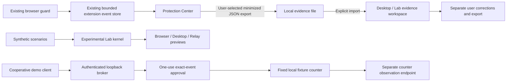

# Vision overhaul

Owner-directed development programme, started 2026-09-08 against upstream
`fd5bdfca0e3b8c21931c77ff78f9e6429eb11f90`.

The direction is one local evidence experience with three roles: Browser explains
the next interaction, Protection Center explains retained observations, and Intent
Relay demonstrates bounded authority for a cooperative client. The original guard
remains the source of browser protection. Experimental scoring is not promoted.

The owner's request activated implementation of this experimental evidence and
prototype programme. It did not approve a public release, native system hooks,
telemetry, or detector efficacy claims. D-2026-09-12-P later moved the named
#640 browser check into the consolidated post-merge AI-47 queue without waiving
its acceptance criteria.

## Map of the supplied bundle

The original `RESOURCES/NavSentinel-Vision-Lab` contains **62 files, 3,065,641
bytes**. [RESOURCE_INVENTORY.json](RESOURCE_INVENTORY.json) lists every original
relative path, category, byte size and SHA-256. The original files remain intact.
Maintained source is now under [experiments/vision-lab](../../experiments/vision-lab/README.md).

| Area | Files and purpose | Adoption |
| --- | --- | --- |
| Entry points | `START-HERE.html`, three `NavSentinel-*.html` files | Retain offline demonstrations; the three modes share one renderer. |
| Package and provenance | `.gitignore`, `LICENSE`, `NOTICE.md`, `package.json`, `README.md`, `START-LAB.cmd`, `START-LAB.sh` | Preserve attribution, add reproducible root commands. |
| Product docs | `docs/{ARCHITECTURE,AGENT-HANDOFF,REALITY-MAP,SOURCE-GROUNDING,SHOWCASE,MANUAL-BROWSER-GATE}.md` | Preserve research context; current implementation and validation below take precedence over dated claims. |
| Shared model | `shared/{core.js,scenarios.js,contracts.d.ts}` | Retain 20 synthetic contracts and uncalibrated policy kernel inside the Lab. |
| Browser/desktop/relay renderer | `web/{app.js,index.html,style.css}` | Maintain common visual language, three themes, evidence import and separate user corrections. |
| Real DOM fixtures | `lab/{index.html,lab.js,lab.css}` | Retain attack, benign and admitted-survivor fixtures with independent counters. |
| Experimental extension | `extension/{manifest.json,worker.js,content.js,popup.*,icon*.png,shared/core.js}` | Keep an opt-in research adapter. Do not replace upstream content scripts with it. |
| Broker | `daemon/{server.cjs,security.cjs}`, `examples/agent.cjs` | Add one fixed measurable fixture effect; preserve strict loopback, expiry, binding and single-use authority. |
| Native shell | `desktop/{main.cjs,preload.cjs,package.json}` | Install and lock the dependency; exercise actual sandboxed renderer, authenticated IPC and shutdown. |
| Build | `scripts/build.cjs` | Regenerate self-contained CSP-pinned HTML and extension kernel copy. |
| Tests | `tests/{core,security,api}.test.cjs`, `ui_smoke.py`, `live_extension.py` | Retain deterministic contracts; add browser tests using real storage/networking and native smoke. |
| Historical evidence | `artifacts/BUILD-MANIFEST.json`, `fixture-manifest.json`, `VALIDATION.md`, `node-tests.tap`, `ui-tests.json`, `live-extension-tests.json`, eight PNGs | Original Linux receipt: 89 Node checks, 52 UI checks with storage/transport substitutions; no installed-extension or native pass. Preserve identity in inventory, generate fresh evidence separately. |

## Working architecture

No automatic extension-to-daemon transport is introduced. Imported records remain
observations, not prevention receipts or authority to proceed. Theme selection is
presentation state and never changes security settings. Recovery remains a
rehearsal. The native shell does not add OS enforcement.

## Existing work reused

| Existing issue | This programme contributes | Still outside this change |
| --- | --- | --- |
| #592, #562 | Protection Center and truthful retained-observation counts | Daily-use validation and claims about attacks prevented |
| #591 | Allowlisted evidence export, explicit import and user correction workspace | Collection of screenshots, DOM or raw diagnostic values |
| #237, #240 | Journal projection and a versioned export/import contract | Side-panel permission and a replacement storage database |
| #601 / PR #608 | Preserve the current trusted-decision boundary | Wiring or merging the separately held pending-decision PR stack |
| #474 | Reuse existing event-store reset; scope imported-data clear explicitly | Reopening the owner's existing behavioural reset decision |
| #449 | Measured fixture effect and real browser UI regression lane | Detection-rate or broad adversarial benchmark claims |
| #445, #446, #448, #452 | Explore relationship, recovery and cooperative-agent views | Promoting the frozen native/agent horizon to shipped protection |

No existing issue is closed solely because a prototype or fixture passes.

## Delivery and verification

See [VALIDATION.md](VALIDATION.md) for current checks, failures and evidence limits,
and [BROWSER_ACCEPTANCE.md](BROWSER_ACCEPTANCE.md) for the small owner-owned
extension acceptance procedure. [ACTION_ITEMS.md](../../ACTION_ITEMS.md) remains
the human-action queue and the authority for current merge/check timing.

Primary native references: Electron's [security guidance](https://www.electronjs.org/docs/latest/tutorial/security),
[context isolation](https://www.electronjs.org/docs/latest/tutorial/context-isolation),
and [44.2.0 release](https://releases.electronjs.org/release/v44.2.0).
