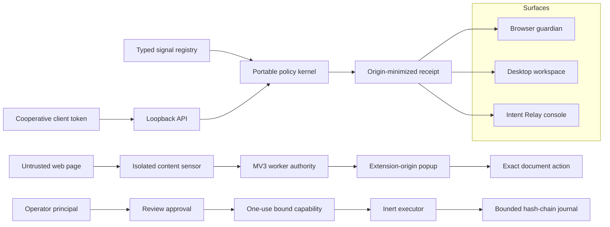

# Architecture and trust boundaries

## Intent: three surfaces, one consequence vocabulary

The browser product protects the next interaction. The desktop product explains the larger journey and supports recovery. The wildcard is a cooperative authority broker for agents and automation. A common event vocabulary joins the designs without pretending the browser and operating system have identical powers.

The lines are implementation boundaries, not claims that the prototypes synchronize with one another. The studio fixture journal, installed-extension journal, and daemon journal have different stores and authority owners.

## Repository layout

- `shared/core.js`: dependency-free UMD kernel, validation, normalization, redacted receipt projection. It is a new experimental implementation, **not a port or parity refactor of upstream scoring.ts**.
- `shared/contracts.d.ts`: portable contracts for migration into a typed codebase.
- `shared/scenarios.js`: 20 attack, benign, and mixed/uncertain contracts.
- `web/`: three coherent renderer experiences sharing views, projections, and styles.
- `extension/`: real but narrowly scoped MV3 prototype. No externally connectable surface, web-accessible resources, or remote code.
- `daemon/security.cjs`: capability store and journal primitives.
- `daemon/server.cjs`: operator/client authentication, fixed contract, loopback static studio and inert fixture server.
- `desktop/`: optional Electron shell. Token stays in the main process; renderer receives a narrow request function, not filesystem or shell access.
- `tests/`: deterministic core, capability, persistence, API and UI checks; live extension runner explicitly classifies environment failures.

## Event and decision model

An event names an actor, action, source/destination URL, context (tab, frame, document, navigation, action ID), typed signal IDs and evidence provenance. Unknown value-bearing fields are rejected. Inputs are bounded; HTTP(S) URLs cannot contain userinfo. The normalized full URL exists only for the immediate decision/capability. Public receipt projection retains the origin.

Positive contributions are capped within groups. Benign relief is capped. Hard invariants cannot be overridden by benign metadata or trust lists. Out-of-contract and unknown-evidence cases cannot become silent allows merely through benign claims. Observe mode records a counterfactual decision without modeling prevention. The weights and fixtures are explicitly experimental and uncalibrated.

Navigation trust and credential trust are distinct exact-host lists. Neither grants wildcard/subdomain trust. These preview preferences are not a hidden control plane for the live extension or service.

## Browser consequence path

1. Installation starts passive. Required loopback access exists for fixtures; other hosts require explicit permission. Exact origins must additionally be enabled in trusted extension UI.
2. The worker registers an isolated script at document_start. A worker handshake checks the exact origin, including port. Broad Chrome match patterns are not treated as exact-origin activation.
3. The content script captures selected clicks and submits. It does not patch MAIN-world APIs or intercept arbitrary requests. Overlay scanning has strict work/ownership bounds.
4. Held consequences are reported through runtime messaging. The worker uses browser-supplied tab/frame/document identity rather than page-supplied identity.
5. Page notices are informational, pointer-inert, and have no allow/Undo controls. A page can imitate a notice but cannot use it to issue an extension action.
6. The popup can undo an owned overlay or authorize one reviewed navigation for a new genuine click. The worker checks the currently active tab, enabled origin, exact document, TTL and action. It burns authority before delivery. The content script checks the original element and unchanged full destination. No click is replayed automatically.
7. Undo refuses to overwrite page-owned changes when the owned display state no longer matches. Disabling an origin unregisters future scripts, broadcasts revocation to matching loaded frames, and restores unchanged owned overlays.

This is not the upstream MAIN/isolated bridge. Unpatchable navigation, mousedown effects before click, requestSubmit/form.submit differences, fetch, page listeners, late-start races, frame policy, closed shadow roots, reappearing layers, and resource pressure require much more evidence before promotion.

## Broker authority path

A random operator token and separate client token are created at service startup. Identity is derived from the token; a client cannot self-label as an operator or independent sensor. The demo reference contract permits only `navigate` to exact origin `https://reference.test`. Other actions have an out-of-contract floor of review; high-risk signals can produce a non-overridable block. `shell-paste` has no executor and is rejected even with no taint metadata.

Approvals bind the client principal plus a SHA-256 digest of the complete normalized event. TTL is at most 30 seconds. Any consume attempt burns the token before caller/context checks. This makes retries explicit and prevents a changed-document attempt from leaving reusable authority. A client polls its own request to receive an operator-approved token. Revocation and restart invalidate in-memory grants.

The service never fetches proposed destinations, invokes commands, uploads files, or reads arbitrary paths. Its “executor” records an inert consequence receipt. This is a useful protocol vertical, not an OS sandbox. Client-declared signals can be incomplete or dishonest; real adapters must independently observe sensitive facts and enforce at the actual consequence boundary.

## Data and lifecycle

| Store | Bound | Authority | Reset / retention |
|---|---:|---|---|
| Studio decisions | 250 | Local renderer | Oldest-first eviction, explicit history clear |
| Studio corrections | 500 | Local renderer | Append-only later facts, explicit history clear |
| Studio preferences | 100 exact hosts per list | Local renderer | Separate reset, validated import preview |
| Extension receipts | 200 | MV3 worker, trusted contexts only | Explicit journal clear |
| Extension transient contexts | 100, up to 5 minutes for Undo; 30 seconds for approval | Worker session store | Expiry, disabled origin, removed tab, browser session end |
| Content overlay ownership | 20 entries | Isolated script | Undo, disable, document destruction |
| Overlay scan budget | 300 passes, at most 500 candidates/pass | Isolated script | Document lifetime; not a sustained-remediation guarantee |
| Broker pending requests | 256, 60 seconds | Node authority | Expiry/revoke/restart |
| Broker capabilities | 256, <=30 seconds | Node authority | One use, mismatch burn, expiry, revoke/restart |
| Broker journal | 500, <=8 KiB/record, <=4 MiB startup file | Node service | Oldest-first anchored eviction; no automatic upload |

Journal replacement uses fsync plus rename; the containing directory is not fsynced. Hash-chain continuity is verified at startup and before appending. A corrupt store is not silently overwritten. This is not a fully crash-proof database or an externally anchored attestation. A same-user process can read token files or rewrite the complete ledger; Windows ACL hardening is a future packaging requirement rather than a claim of POSIX mode equivalence.

## Deployment and compatibility

The three generated HTML files need no install and no remote resources. Content Security Policy pins their inline scripts by hash and prohibits network access. The source studio uses only locally served scripts and same-origin API calls. The Node service needs version 22 or later and no npm dependencies. Never bind it to a LAN/public interface or publish its session tokens.

Electron 44.2.0 is a separate, optional pinned dependency verified against the official stable release index on 2026-09-07. The repository-root install and desktop smoke commands exercise this pinned dependency locally. From the repository root, run `npm run vision:desktop:install`, then `npm run vision:desktop`; stop the standalone service before launching the shell. Signing, installers, updates, native-service installation and user-data ACLs are not provided.

## Promotion gates

Keep this bundle under an experimental directory or branch. Preserve upstream authority paths and current release gates. Promote one small interaction/evidence slice only after actual browser traces, attack/benign/mixed controls, sustained effect checks, privacy review, and exact-artifact receipts. A screenshot, test count, or attractive prototype must not waive those gates.
